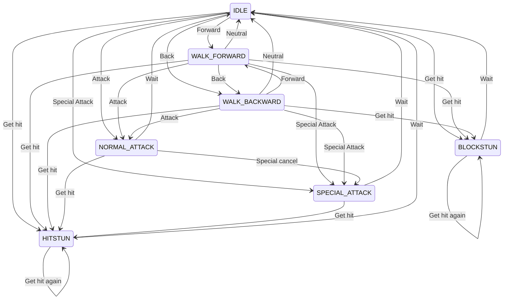

# Jabjab state machine

I'm thinking about representing the various states a character can be in using a state machine. The transitions would be conditions required to go the next state, for example : to go from `IDLE` to `WALK_FORWARD`, the condition is to press the forward direction.

Here's the state diagram for a simple fighting game in which the player can

- walk
- normal attack
- special attack
- cancel normal attack into special attack
- get hit

